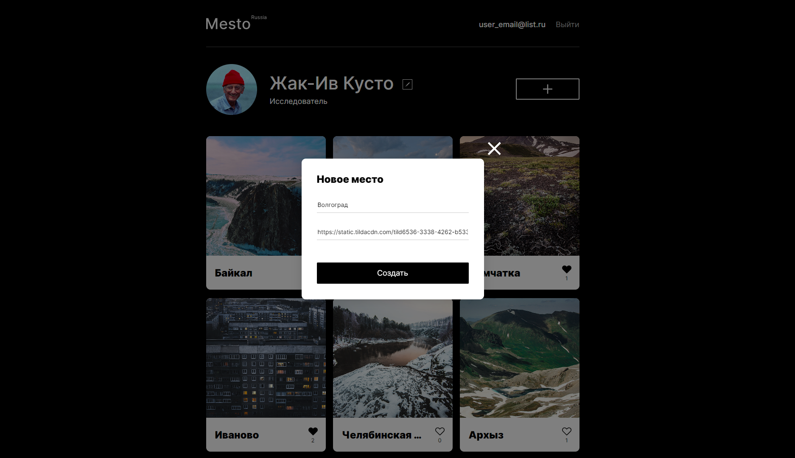
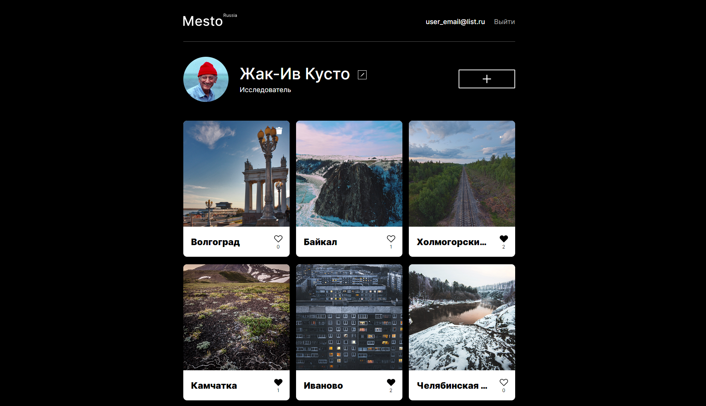

# react-mesto-api-full

## 1. Описание

Репозиторий для проекта `Mesto`, адаптивного приложения (SPA), написанного на React (часть frontend) и Node.js (часть backend), с возможностью регистрации личного кабинета пользователя, редактированием данных и добавлением фотокарточек в общую галерею.

Адрес репозитория: https://github.com/o4ico/react-mesto-api-full-gha

Ссылки на макет:
- [макет 4 спринта](https://www.figma.com/file/2cn9N9jSkmxD84oJik7xL7/JavaScript.-Sprint-4?type=design&node-id=0-1&mode=design)
- [макет 5 спринта](https://www.figma.com/file/bjyvbKKJN2naO0ucURl2Z0/JavaScript.-Sprint-5?type=design&node-id=0-1&mode=design)
- [макет 6 спринта](https://www.figma.com/file/kRVLKwYG3d1HGLvh7JFWRT/JavaScript.-Sprint-6?type=design&node-id=0-1&mode=design)
- [макет 9 спринта](https://www.figma.com/file/PSdQFRHoxXJFs2FH8IXViF/JavaScript.-Sprint-9?type=design&node-id=0-1&mode=design)
- [макет 12 спринта](https://www.figma.com/file/5H3gsn5lIGPwzBPby9jAOo/JavaScript.-Sprint-12?type=design&node-id=0-1&mode=design)

## 2. Стек

## 3. Развертывание проекта локально

1. `git clone https://github.com/o4ico/react-mesto-api-full-gha.git` - клонировать репозиторий (HTTPS) на свое устройство
2. `npm i` - установить зависимости (отдельно - в папке frontend и backend)
3. `npm run dev` - запустить приложение в режиме разработчика в папке backend
4. `npm run start` - запустить приложение в режиме разработчика в папке frontend
